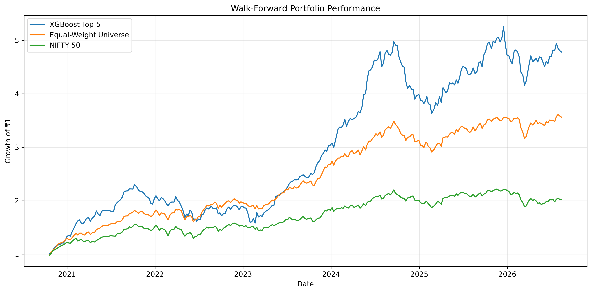
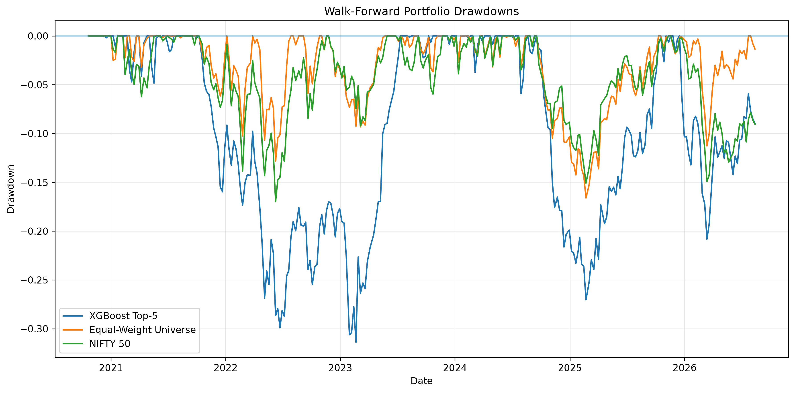

# ML-Based Algorithmic Trading & Portfolio Backtesting

An end-to-end quantitative trading research project that uses **XGBoost** to rank stocks based on their expected 5-day excess returns and construct a systematic **Top-5 equal-weight portfolio**.

The project covers market data collection, feature engineering, cross-sectional stock ranking, transaction-cost-aware backtesting, expanding-window walk-forward validation, benchmark comparison, and statistical evaluation.

---

## Project Overview

The objective is to investigate whether machine learning can identify stocks likely to outperform the broader stock universe over the next 5 trading days.

Instead of directly predicting stock prices, the final model predicts each stock's **future excess return relative to the cross-sectional market average**.

The predicted values are then used to rank stocks and construct a concentrated Top-5 portfolio.

### Pipeline

```text
Historical OHLCV Data
        ↓
Feature Engineering
        ↓
Momentum / Volatility / Trend / RSI / MACD / Volume
        ↓
5-Day Forward Excess Return Target
        ↓
XGBoost Regression
        ↓
Cross-Sectional Stock Ranking
        ↓
Select Top 5 Stocks
        ↓
Equal-Weight Portfolio
        ↓
5-Day Rebalancing
        ↓
Turnover-Based Transaction Costs
        ↓
Expanding-Window Walk-Forward Validation
        ↓
Performance & Statistical Analysis
```

---

## Stock Universe

The experiment uses a fixed universe of large-cap Indian equities based on a contemporary NIFTY 50-style universe.

After preprocessing and data-availability filtering, **49 stocks** were available for the final ML dataset.

> **Important:** The historical experiment uses a fixed contemporary stock universe rather than point-in-time historical NIFTY 50 membership. This introduces survivorship/constituent-selection bias and is an important limitation of the backtest.

---

## Dataset

Historical OHLCV data is downloaded using `yfinance`.

The full feature dataset contains approximately:

- **144,100 raw stock-date observations**
- Data from **2015 to August 2026**
- **49 stocks** in the final ML-ready universe

Adjusted prices are used through:

```python
yf.download(..., auto_adjust=True)
```

---

## Feature Engineering

The final model uses **14 features** covering momentum, volatility, trend, technical indicators, and trading activity.

### Return & Momentum

- 1-day return
- 5-day momentum
- 10-day momentum
- 20-day momentum
- 60-day momentum

### Volatility

- 20-day rolling volatility

### Moving-Average Features

- Price / MA20 ratio
- Price / MA50 ratio
- Price / MA200 ratio

### Technical Indicators

- RSI (14)
- Normalized MACD
- Normalized MACD signal
- Normalized MACD histogram

### Volume

- Volume / 20-day average volume

---

## Prediction Target

The final model predicts the stock's **5-day forward excess return**:

```text
Stock 5-Day Forward Return
              -
Cross-Sectional Average 5-Day Forward Return
```

This changes the task from predicting absolute market direction to identifying stocks expected to **outperform other stocks in the universe**.

---

## Model

The final model is an **XGBoost Regressor**.

```python
XGBRegressor(
    n_estimators=300,
    max_depth=3,
    learning_rate=0.03,
    subsample=0.8,
    colsample_bytree=0.8,
    objective="reg:squarederror",
    random_state=42,
    n_jobs=-1
)
```

Predictions are ranked cross-sectionally for every trading date.

The five stocks with the highest predicted excess returns form the portfolio.

---

## Portfolio Construction

The strategy uses:

- Top **5** predicted stocks
- Equal weighting
- 5-trading-day holding period
- Rebalancing every 5 trading days
- Next-day execution
- Expanding-window model retraining

Each selected stock initially receives approximately:

```text
20% portfolio weight
```

---

## Avoiding Look-Ahead Bias

Features are calculated using information available through the signal date.

The trading return is constructed using a delayed entry:

```python
trade_return_5d = close.shift(-6) / close.shift(-1) - 1
```

Conceptually:

```text
Day t
Features observed after market close
        ↓
Day t+1
Portfolio entry
        ↓
Day t+6
Portfolio exit
```

A **5-trading-day purge** is also applied between training and prediction periods to reduce target leakage across model boundaries.

---

## Walk-Forward Validation

Rather than relying on a random train/test split, the final evaluation uses **expanding-window walk-forward validation**.

### Configuration

| Parameter | Value |
|---|---:|
| Initial training history | 5 years |
| Retraining frequency | 20 trading days |
| Purge period | 5 trading days |
| Portfolio size | Top 5 stocks |
| Holding period | 5 trading days |
| Transaction-cost assumption | 10 bps × turnover |

The model is repeatedly retrained using only historical observations available before each prediction block.

The walk-forward prediction period covers approximately:

```text
October 2020 → August 2026
```

with **1,446 prediction dates** before non-overlapping portfolio sampling.

---

## Transaction Costs

Transaction costs are modeled using actual portfolio turnover instead of subtracting a constant fee at every rebalance.

For a Top-5 portfolio:

```text
Turnover = 1 - (Retained Stocks / 5)
```

and:

```text
Transaction Cost = Turnover × 0.001
```

where `0.001` represents a 10 basis-point cost assumption.

This means a portfolio retaining most of its previous holdings incurs a smaller trading cost than a completely replaced portfolio.

---

# Walk-Forward Results

The strategy is compared against:

1. **XGBoost Top-5 Portfolio**
2. **Equal-Weight Stock Universe**
3. **NIFTY 50**

### Overall Walk-Forward Performance

| Metric | XGBoost Top-5 | Equal-Weight Universe | NIFTY 50 |
|---|---:|---:|---:|
| Total Return | **373.2%** | 255.3% | 101.7% |
| CAGR | **31.0%** | 24.7% | 13.1% |
| Annual Volatility | 21.0% | **14.0%** | 14.1% |
| Sharpe Ratio | 1.39 | **1.65** | 0.94 |
| Sortino Ratio | 2.19 | **2.61** | 1.50 |
| Max Drawdown | **-31.4%** | -16.6% | -17.0% |

The ML portfolio generated the highest absolute return and CAGR but also experienced substantially higher volatility and drawdown.

The equal-weight portfolio produced better risk-adjusted performance, demonstrating that the ML strategy's additional return came with significantly greater concentration risk.

---

## Equity Curve



---

## Drawdown



The ML strategy experienced a maximum drawdown of approximately **-31.4%**, with its worst drawdown occurring around **20 February 2023**.

This is substantially larger than the drawdowns of the equal-weight and NIFTY benchmarks.

---

## Year-by-Year Performance

| Year | ML Strategy | Equal Weight | NIFTY 50 |
|---|---:|---:|---:|
| 2020* | 24.74% | 25.92% | 19.61% |
| 2021 | **63.34%** | 41.27% | 25.56% |
| 2022 | **-6.94%** | 10.51% | 2.00% |
| 2023 | **60.36%** | 35.90% | 18.85% |
| 2024 | **31.08%** | 17.07% | 10.20% |
| 2025 | **18.18%** | 13.39% | 9.15% |
| 2026* | **2.35%** | 1.46% | -7.89% |

\* 2020 and 2026 represent partial years in the walk-forward evaluation window.

The strategy performed particularly strongly in 2021 and 2023–2025 but struggled during 2022.

This highlights the importance of evaluating ML trading systems across multiple market regimes rather than relying only on aggregate CAGR.

---

# Excess Return Analysis

To evaluate whether the ML strategy consistently outperformed the equal-weight universe, 5-day strategy excess returns were analyzed.

### Results

| Statistic | Result |
|---|---:|
| Observations | 288 |
| Mean 5-day excess return | +0.126% |
| Median 5-day excess return | +0.049% |
| Annualized mean excess | +6.37% |
| Information Ratio | 0.456 |
| Bootstrap 95% CI | -0.096% to +0.358% |
| Confidence interval excludes zero | No |

Although the strategy produced positive average excess returns, the bootstrap confidence interval includes zero.

Therefore, the results provide evidence of **economically meaningful historical outperformance**, but do not establish statistically conclusive persistent alpha.

---

# Model Development

Several formulations were investigated before freezing the final strategy.

### V1 — Binary Classification

Predicted whether a stock belonged to approximately the top 30% of future performers.

Validation ROC-AUC was only slightly above random ranking.

### V2 — Cross-Sectional Features

Added additional cross-sectional ranking features.

Validation performance did not improve sufficiently over V1.

### V3 — Continuous Percentile Ranking

Predicted future cross-sectional return percentile.

The model produced weak rank correlation and was not promoted to final testing.

### V4 — Excess-Return Regression

The final model predicts:

```text
Stock Future Return - Universe Future Return
```

This formulation produced the strongest validation ranking behavior and was frozen before the final evaluation.

No additional model, feature, Top-K, or holding-period tuning was performed based on the final walk-forward results.

---

# Key Findings

The experiment suggests that an ML-based cross-sectional ranking model can identify portfolios with higher historical absolute returns than passive benchmarks.

However, three findings are particularly important:

- The **Top-5 ML portfolio achieved higher CAGR** than both equal-weight and NIFTY benchmarks.
- The **equal-weight portfolio achieved a higher Sharpe ratio and much smaller drawdown**, indicating superior risk-adjusted performance.
- The ML strategy's bootstrap excess-return confidence interval included zero, so persistent alpha cannot be established conclusively.

The project therefore demonstrates both the potential and limitations of machine-learning-based stock selection.

---

# Project Structure

```text
algorithmic-trading-ml/
│
├── notebooks/
│   ├── 01_market_data.ipynb
│   ├── 02_stock_universe.ipynb
│   ├── 03_feature_engineering.ipynb
│   ├── 04_backtesting.ipynb
│   └── 05_walk_forward.ipynb
│
├── data/
│   ├── walk_forward_data.csv
│   └── walk_forward_results.csv
│
├── results/
│   ├── equity_curve.png
│   ├── drawdown.png
│   └── yearly_returns.csv
│
├── requirements.txt
├── .gitignore
└── README.md
```

---

# Notebook Workflow

### `01_market_data.ipynb`

Initial market-data exploration and technical-indicator construction.

### `02_stock_universe.ipynb`

Stock-universe preparation and data exploration.

### `03_feature_engineering.ipynb`

Contains:

- Multi-stock data preparation
- Feature engineering
- Target construction
- V1–V4 model experiments
- Validation analysis
- Final dataset generation

### `04_backtesting.ipynb`

Contains:

- Portfolio construction
- Initial out-of-sample backtesting
- Transaction-cost modeling
- Benchmark comparison
- Performance metrics

### `05_walk_forward.ipynb`

Contains the final evaluation:

- Expanding-window retraining
- Purged training periods
- Cross-sectional predictions
- Top-5 portfolio construction
- Turnover-adjusted costs
- Equal-weight comparison
- NIFTY comparison
- Drawdown analysis
- Yearly performance
- Bootstrap analysis

---

# Installation

Clone the repository:

```bash
git clone <repository-url>
cd algorithmic-trading-ml
```

Create a virtual environment:

```bash
python -m venv venv
```

### Windows

```bash
venv\Scripts\activate
```

Install dependencies:

```bash
pip install -r requirements.txt
```

Start Jupyter:

```bash
jupyter notebook
```

Run the notebooks in numerical order.

---

# Technologies Used

**Language**

- Python

**Data Processing**

- Pandas
- NumPy

**Machine Learning**

- XGBoost
- Scikit-learn

**Market Data**

- yfinance

**Visualization**

- Matplotlib

**Development**

- Jupyter Notebook
- VS Code
- Git / GitHub

---

# Limitations

This project is a research backtest and should not be interpreted as evidence of guaranteed future profitability.

Important limitations include:

### Survivorship / Constituent Bias

The historical backtest uses a fixed contemporary large-cap stock universe rather than reconstructing historical NIFTY 50 membership for every date.

This can materially inflate historical results because companies that disappeared or left the index may not be represented.

### Simplified Execution

Signals are generated using end-of-day information and evaluated using next-day prices. Real execution would involve spreads, intraday price movement, liquidity constraints, and order execution uncertainty.

### Transaction Costs

Transaction costs are modeled as:

```text
10 bps × portfolio turnover
```

This is more realistic than assuming zero costs but does not explicitly model bid-ask spread, slippage, taxes, brokerage structure, or market impact.

### Target / Execution Difference

The model target is based on forward excess return calculated from the signal-date price, while the tradable backtest uses delayed next-day execution.

A production-grade implementation should align the training target exactly with the executable return interval.

### Statistical Uncertainty

The bootstrap confidence interval for mean ML excess return includes zero.

Therefore, the observed historical outperformance should not be interpreted as statistically proven persistent alpha.

### Risk Concentration

Selecting only five stocks creates considerably more concentration risk than holding the full equal-weight universe or NIFTY 50.

This is reflected in the strategy's higher volatility and maximum drawdown.

---

# Future Improvements

Potential extensions include:

- Point-in-time historical NIFTY constituent data
- Exact next-open execution modeling
- More detailed slippage and transaction-cost models
- Sector-neutral portfolio construction
- Volatility-adjusted position sizing
- Portfolio optimization
- Exposure and factor analysis
- Additional walk-forward robustness tests
- Alternative ranking models such as LightGBM or learning-to-rank approaches

These extensions should ideally be evaluated on new out-of-sample data rather than repeatedly optimized against the existing walk-forward period.

---

## Disclaimer

This project is intended for **educational and research purposes only**.

It is not financial advice, and historical backtest performance does not guarantee future results.
